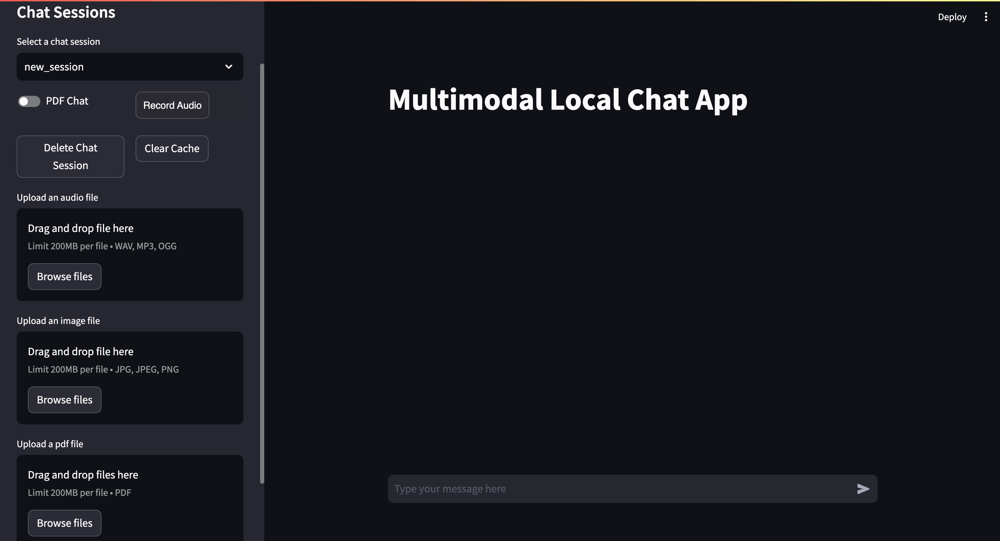

# Multimodal Open Source LLM Based Chat App

##### Note: This project is inspired by [@Leon-Sander](https://github.com/Leon-Sander/local_multimodal_ai_chat), to find a more deatiled project and upto date changes, check out his repository. You can also post issues, if you encounter any.

## Tasks

##### Following are the subtasks that were done in this project
- **Task 1**: Creating a vector database for storing embeddings.
- **Task 2**: Creating different data handling programs. (subtasks include: making image handler, pdf handler, audio handler)
- **Task 3**: Writing config.yaml file to directly configure the whole chatbot.
- **Task 4**: Creating a streamlit based UI for the chatbot.
- **Python-based**: Entirely coded in Python.

## Working of the project
- User is provided with options to upload the kind of data that they want to interact with.
- The model locally process the data, and store it in the database as embeddings.
- The processing will take around 2-3 minutes, then user can chat with their data.

## Points to Note
- This program expects you to locally download the models, to avoid getting API call limits.
- [lava model used for image chat (ggml-model-q5_k.gguf and mmproj-model-f16.gguf)](https://huggingface.co/mys/ggml_llava-v1.5-7b/tree/main)
- [the quantized mistral model form TheBloke (mistral-7b-instruct-v0.1.Q5_K_M.gguf)](https://huggingface.co/TheBloke/Mistral-7B-Instruct-v0.1-GGUF/blob/main/mistral-7b-instruct-v0.1.Q5_K_M.gguf)

### Brief explanation of how LLMs works

Large Language Models (LLMs) utilize transformer architectures for processing sequential data efficiently. Through pre-training on vast text corpora, LLMs learn language patterns. Fine-tuning on specific tasks further enhances their performance. Their ability to generate text stems from predicting the next word based on context, employing self-attention mechanisms to weigh word importance. LLMs excel in various tasks such as language translation, summarization, and question answering. This versatility, coupled with their capability to understand and generate human-like text, marks LLMs as powerful tools with broad applications across natural language processing tasks.



## Installation & Running

**Important!:** Ensure you have Python installed on your system. 

Clone this repository:

```bash
git clone [repository-link]
```
Go to the cloned folder:

```bash
cd [repository-directory]
```

Install the required packages:

```bash
pip install -r requirements.txt
```
Running the ChatBot:

```bash
streamlit run app.py
```
